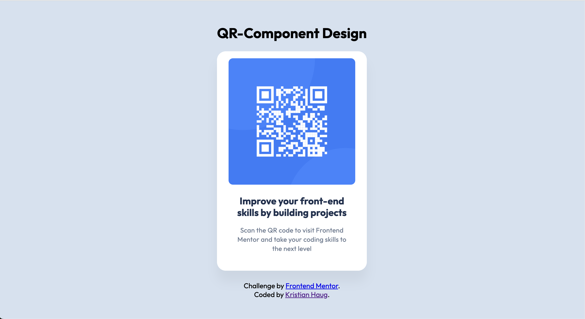

# Frontend Mentor - QR code component solution

This is my solution to the first task at Frontend Mentor - QR Component

Built with basic HTML and CSS.

I got a refresher on CSS-variables, and learned how to work with professional figma-files. 

It was fun!

